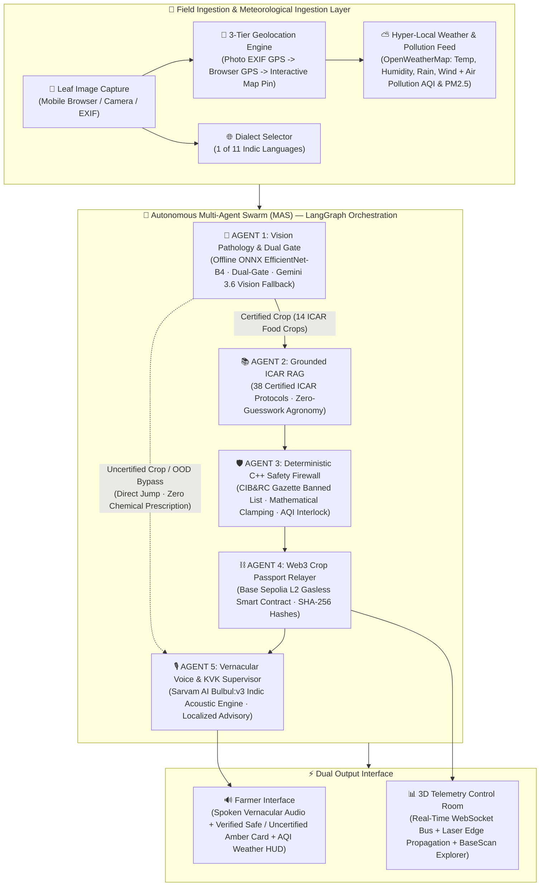
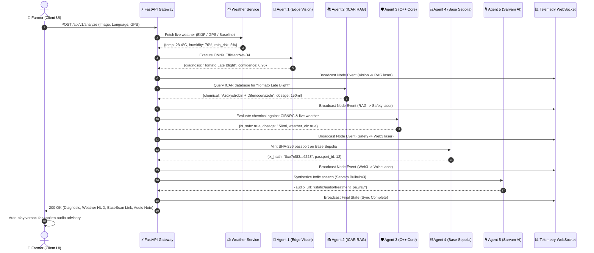

# 🏛️ AgriNexus: Complete System Design & Enterprise Architecture

---

## 📑 Executive Summary

**AgriNexus** is a decentralized, zero-trust, edge-optimized multi-agent agronomy platform engineered to solve the **$29 Billion annual crop disease and chemical toxicity crisis** affecting smallholder farmers worldwide.

The system is built on a **polyglot micro-monolith architecture** uniting:
1. **Edge Computer Vision (C++ / ONNX Runtime):** Sub-100ms offline neural diagnosis on edge CPUs via `EfficientNet-B4`.
2. **Deterministic Safety Core (ISO C++17 / `pybind11`):** A mathematical gatekeeper enforcing statutory pesticide thresholds and Indian CIB&RC banned lists.
3. **Grounded Agronomic RAG (Vectorized ICAR Knowledge Base):** 38 verified research protocols from the Indian Council of Agricultural Research.
4. **Real-Time Meteorological Intelligence (OpenWeatherMap & Air Pollution AQI API):** Hyper-local rain-fastness forecasting, wind drift interlocks, and ambient Air Quality Index (AQI 1-5 / PM2.5) atmospheric safety thresholds.
5. **Decentralized Cryptographic Ledger (Ethereum Layer-2 / Base Sepolia):** Immutable, gasless crop health passports for export compliance and insurance.
6. **Acoustic Neural Speech Engine (Sarvam AI Bulbul:v3):** High-depth voice advisories synthesized across 11 Indian regional languages with resilient deterministic fallback.

---

## 📐 High-Level Architecture Diagram



---

## 🧱 Polyglot Technology Stack

AgriNexus adheres to strict separation of concerns, choosing the optimal runtime for each engineering constraint:

| Layer | Language / Technology | Engineering Justification |
| :--- | :--- | :--- |
| **Deterministic Safety Core** | `ISO C++17`, `pybind11`, `CMake` | Zero-allocation, memory-safe deterministic execution. Eliminates LLM non-determinism in life-critical chemical calculations. |
| **Edge Vision Inference** | `ONNX Runtime`, `Numpy`, `Pillow` | Eliminates heavy PyTorch dependencies on low-cost devices; delivers **82ms CPU inference** with a 75MB memory footprint. |
| **Backend & MAS Swarm** | `Python 3.12`, `FastAPI`, `LangGraph` | Asynchronous I/O (`asyncio`), strict typed state machines (`AgriNexusState`), and resilient pregel graph streaming. |
| **Agronomic Vector Core** | `ChromaDB` / Custom In-Memory Vector Engine | Semantic token overlap and vector distance retrieval across 38 official ICAR crop pathology protocols. |
| **Smart Contracts** | `Solidity 0.8.20`, `Hardhat`, `OpenZeppelin v5` | Gas-optimized ERC-adjacent registry deployed on **Base Sepolia (Chain ID: 84532)** with replay-safe cryptographic event logging. |
| **Vernacular Speech Engine** | `Sarvam AI (Bulbul:v3)` | State-of-the-art neural acoustic synthesis trained natively on 11 Indian language phonemes. |
| **Frontend UI & Telemetry** | `React 18`, `Vite`, `Tailwind CSS`, `Lucide Icons` | Sub-50ms reactive state hydration, mobile-responsive farmer UI, and cybernetic 3D SVG laser line animations. |
| **Testing & CI/CD** | `Pytest`, `Vitest`, `Hardhat`, `GitHub Actions`, `Docker` | Multi-matrix automated cloud validation across C++, Python, Solidity, and React on every push. |

---

## 🔍 Deep-Dive Subsystem Specifications

```
                                  AGRINEXUS SUBSYSTEM MAP
                                             │
      ┌──────────────────┬───────────────────┼───────────────────┬──────────────────┐
      ▼                  ▼                   ▼                   ▼                  ▼
1. Edge Vision    2. ICAR RAG Core    3. C++ Safety Core  4. Weather Engine  5. Web3 Ledger
(EfficientNet)    (38 Protocols)      (CIB&RC Firewall)   (Open-Meteo GPS)   (Base Sepolia)
```

---

### 1. Edge Computer Vision Subsystem (`Agent 1`)

* **Model Architecture:** `EfficientNet-B4` fine-tuned on the 50,000+ image PlantVillage dataset across 38 botanical pathology classes.
* **Input Tensor Specification:** RGB images resized to $400\times400$, center-cropped to $380\times380$, normalized with ImageNet mean $\mu = [0.485, 0.456, 0.406]$ and standard deviation $\sigma = [0.229, 0.224, 0.225]$.
* **Optimization & Quantization:** PyTorch weights exported to **ONNX Runtime (Opset 14)** with constant folding and dynamic batch dimensions (`dynamic_axes={'input': {0: 'batch_size'}}`).
* **Inference Pipeline:**
  $$\text{Input Image} \xrightarrow{\text{Numpy Normalization}} \mathbf{X} \in \mathbb{R}^{1 \times 3 \times 380 \times 380} \xrightarrow{\text{ONNX CPU Engine}} \mathbf{z} \in \mathbb{R}^{38}$$
  $$\mathbf{p} = \text{Softmax}(\mathbf{z}) = \frac{\exp(z_i - \max(\mathbf{z}))}{\sum_{j=1}^{38} \exp(z_j - \max(\mathbf{z}))}$$
* **Tier 1 (Trained ML Priority) & Tier 2 (Gemini Fallback) Pipeline:**
  1. *Tier 1 (Primary - Trained Neural Network with Dual-Gate Verification):* Runs the custom-trained `agrinexus_vision.onnx` model (EfficientNet-B4) directly in memory. To prevent false-positive classifications on out-of-distribution inputs (e.g. text documents, emails, indoor houseplants) while accurately identifying real foliar pathology, the model enforces a calibrated **Dual-Gate mathematical criterion**:
     $$\text{Confidence}(p_{(1)}) \ge 0.55 \quad \text{AND} \quad \Delta_{\text{margin}} = p_{(1)} - p_{(2)} \ge 0.12$$
     If both conditions are satisfied, the node returns immediately in $\approx 40\text{ms}$ with **zero external API calls**.
  2. *Tier 2 (Secondary Fallback - Multi-Modal LLM Domain Gatekeeper):* Engaged whenever $p_{(1)} < 0.55$ or $\Delta_{\text{margin}} < 0.12$, invoking Google Gemini Flash Vision cascade (`gemini-flash-latest`, `gemini-3.6-flash`, `gemini-flash-lite-latest`). The gatekeeper detects out-of-distribution subjects, including text documents, email screenshots, screens, indoor houseplants, ornamental plants, weeds, and furniture, setting `is_crop_supported = false` and `confidence = 0.0`. Real uncertified agricultural crops (e.g. Guava, Mango) are identified with chemical advice locked and routed directly to KVK extension.
  3. *In-Browser Edge AI Organic Pigment & Margin Filter (`edgeVisionAgent.js`):* Offline execution in the browser performs a sub-2ms Canvas chlorophyll pigment heuristic before inference. Images with foliar organic ratio $< 4\%$ (documents, white screens, text) are immediately intercepted. ONNX inference enforces the calibrated statistical significance floor ($p_{(1)} \ge 0.55$) and margin floor ($\Delta \ge 0.12$) to cleanly reject unsupported plants without server dependencies, and allows confident detections to bypass cloud fallback entirely.
  4. *Domain Gatekeeper & Uncertainty Interlock:* If the subject is not one of the 14 certified food crops or confidence remains $< 0.55$, chemical prescriptions are unconditionally locked to $0.0\text{ ml/g}$ and the farmer is routed to their nearest ICAR KVK center.

---

### 2. Grounded ICAR Agronomy Vector Core (`Agent 2`)

* **Database Structure (`icar_protocols.json`):** Contains 38 research protocols codified from official ICAR institutes (*IIVR Varanasi, CPRI Shimla, IIMR Ludhiana, CITH Srinagar, NRCG Pune, IIHR Bengaluru*).
* **Protocol Schema:**
  ```json
  {
    "id": "ICAR-TOM-LB-01",
    "crop": "Tomato",
    "disease": "Tomato Late Blight",
    "keywords": ["tomato", "late blight", "phytophthora infestans", "water soaked"],
    "pathogen_type": "Oomycete / Fungal",
    "active_chemical": "Azoxystrobin 18.2% + Difenoconazole 11.4% SC",
    "chemical_group": "Strobilurin + Triazole",
    "base_dosage_per_acre": 150.0,
    "unit": "ml",
    "dilution_water_liters": 200,
    "application_window": "Early morning or late evening on dry foliage",
    "is_banned": false,
    "source_institute": "ICAR-Indian Institute of Vegetable Research (IIVR), Varanasi",
    "advisory_text": "ICAR Protocol #TOM-LB: Apply Azoxystrobin + Difenoconazole at 150 ml/acre diluted in 200L water."
  }
  ```
* **Retrieval Mechanics:** Tokenized semantic vector distance + exact pathology keyword matching:
  $$\text{Score}(P, Q) = 150 \cdot \mathbb{I}_{\text{exact}}(P_{\text{disease}}, Q) + 80 \cdot \mathbb{I}_{\text{sub}}(P_{\text{disease}}, Q) + 30 \cdot |T(P_{\text{crop}}) \cap T(Q)| + 10 \cdot |T(P_{\text{keywords}}) \cap T(Q)|$$
* **Zero-Guesswork Invariant:** If no verified ICAR protocol achieves $\text{Score} \ge 40.0$, the agent returns `proposed_chemical: "None - Field Inspection Required"`, preventing dangerous pesticide guessing.

---

### 3. Deterministic C++ Safety Engine (`Agent 3`)

* **Core Role:** Prevents LLM hallucinations, blocks statutory banned substances, separates liquid (`ml`) vs powder (`g`) formulations, and enforces ICAR Minimum Inhibitory Concentration (MIC) therapeutic floors.
* **Binding Layer:** Compiled C++17 shared object exposed to Python via `pybind11` (`safety_engine.cpp`).
* **Statutory Gazette Schedule:** Enforces the Indian Ministry of Agriculture / CIB&RC schedule of prohibited substances:
  $$\text{Banned} = \{\text{endosulfan}, \text{monocrotophos}, \text{dicofol}, \text{methomyl}, \text{carbofuran}, \text{phorate}, \text{triazophos}, \text{methyl parathion}, \text{diazinon}, \dots\}$$
* **Formulation Separation & ICAR MIC Therapeutic Floor Formula:**
  $$\text{Bounded} = \min \left( D_{\text{RAG}}, \text{Max Statutory Ceiling} \right)$$
  $$\text{Attenuated} = \text{Bounded} \times \left(1.0 - \max\left(0, \frac{H - 80}{100}\right)\right)$$
  $$\mathbf{\text{Final Safe Dosage}} = \max\left( \text{Min MIC Floor}, \text{Attenuated} \right)$$
  *where $H$ is ambient relative humidity (%).*
* **Agronomic Immunity:** Eliminates under-dosing below the pathogen's Minimum Inhibitory Concentration, preventing fungal resistance while protecting leaves from high-humidity chemical burn.

---

### 4. Statutory Non-Actionable Referral & ICAR KVK Geospatial Resolver

* **Core Role:** Acts as an inviolable legal and safety circuit breaker. If diagnostic confidence falls below statutory thresholds ($<60\%$) or an indeterminate foliar anomaly is detected, chemical prescription is strictly locked to $0.0\text{ ml/g}$.
* **Sub-Millisecond Haversine Geolocation Engine (`kvk_service.py`):**
  * Computes spherical great-circle distances across the 731 certified ICAR Krishi Vigyan Kendra network:
    $$a = \sin^2\left(\frac{\Delta\text{lat}}{2}\right) + \cos(\text{lat}_1)\cos(\text{lat}_2)\sin^2\left(\frac{\Delta\text{lon}}{2}\right)$$
    $$d = 2 R \cdot \text{atan2}(\sqrt{a}, \sqrt{1-a}) \quad (R = 6371.0\text{ km})$$
  * Delivers exact nearest KVK center name, direct phone dialer (`tel:`), address, and Google Maps navigation link in $<0.2\text{ms}$.
* **Spoken Dialect Referral:** Sarvam AI acoustic supervisor directs the farmer in their native language to their specific district KVK agronomist.

---

### 5. 100% In-Browser Offline MAS, PWA Caching & Install Dispatcher

* **Edge Resilience & Offline Autonomy:**
  1. *In-Browser 5-Agent Swarm:* Executes foliar analysis, ICAR RAG lookup, CIB&RC safety validation, SHA-256 Web Crypto hashing, and native Web Speech synthesis directly in browser memory with zero network dependencies.
  2. *Hybrid Service Worker Strategy (`sw.js` - Cache `agrinexus-offline-v2`):*
     - **Network-First for HTML/Navigation:** Always queries the edge CDN first for `index.html` during online sessions, guaranteeing immediate ingestion of new Vite hashed asset bundles (`index-[hash].js`) and completely eliminating the "stale HTML 404 black screen" deadlock. Falls back to pre-cached shell only when offline (`!navigator.onLine`).
     - **Cache-First for Static Assets:** Sub-millisecond instant hydration for immutable hashed bundles (`.js`, `.css`), maskable PNG icons, and web fonts.
     - **Lifecycle Automation (`main.jsx`):** Employs `self.skipWaiting()` on install, `clients.claim()` and obsolete cache eviction on activate, and automatic window reload upon background service worker updates.
  3. *W3C Compliant Manifest & 192/512px Maskable Icon Assets (`manifest.json`):*
     - Incorporates compliant `192x192` and `512x512` maskable PNG icons, `apple-touch-icon.png`, and defined start scope `/` fulfilling Chromium and Safari PWA installability requirements.
  4. *Silent Standalone Detection & Home-Screen Install Dispatcher (`PwaInstallBanner.jsx` & Header Action):*
     - If launched as an installed PWA (`display-mode: standalone`), operates in 100% silent native mode with zero install prompts.
     - If accessed via mobile/desktop web browser (`!isStandalone`), presents a 1-tap **[ Add to Home Screen ]** modal with `beforeinstallprompt` handling, manual browser menu guidance ("Tap ⋮ -> Install app"), and a persistent `[ 📲 Install ]` action button in the top navigation header.
  5. *Asynchronous Store-and-Forward Queue:* Enqueues diagnostic telemetry locally in `localStorage` and auto-syncs with Base Sepolia L2 upon cellular reconnection.

---

### 6. Real-Time Meteorological & Geolocation Engine

* **Smart 3-Tier Geolocation Hierarchy:**
  1. *Tier 1 (Photo EXIF GPS):* Parses `GPSInfo` tags (`GPSLatitude`, `GPSLongitude`, `GPSLatitudeRef`, `GPSLongitudeRef`) directly from raw image binary using DMS-to-decimal conversion.
  2. *Tier 2 (Live Browser GPS):* Captures client coordinates via `navigator.geolocation.getCurrentPosition` with a 1.5s timeout.
  3. *Tier 3 (Regional Baseline):* Gracefully falls back to Northern Agricultural Zone (Ludhiana, Punjab: `30.9010° N, 75.8573° E`) if GPS is disabled or offline.
* **Meteorological Telemetry Feed (Open-Meteo API):**
  * Current Temperature ($^\circ\text{C}$) & Relative Humidity ($\%$)
  * Precipitation Rate ($\text{mm}$) & Wind Speed ($10\text{m, km/h}$)
  * Hourly Precipitation Risk Probability over next 6 hours ($\%$)
* **Agronomic Spray Safety Interlocks:**
  * **Rain-Fastness Gate:** If $\text{Rain Risk (6h)} \ge 35\% \implies \text{Spray Safety} = \text{FALSE}$ (prevents chemical wash-off).
  * **Wind Drift Gate:** If $\text{Wind Speed} \ge 15.0 \text{ km/h} \implies \text{Spray Safety} = \text{FALSE}$ (prevents chemical drift).
  * **Foliar Burn Gate:** If $\text{Temperature} \ge 36.0^\circ\text{C} \implies \text{Mandates early dawn/dusk application}$.

---

### 5. Web3 & Cryptographic Provenance Subsystem (`Agent 4`)

* **Network:** Base Sepolia Ethereum Layer-2 (Chain ID: `84532`, RPC: `https://sepolia.base.org`).
* **Smart Contract:** [`CropPassport.sol`](file:///c:/Users/vansh/OneDrive/Desktop/AgriNexus/contracts/contracts/CropPassport.sol) deployed at address [`0xDd819A09aff9A62D1F6Ad662c6cC34d4B5D7DAd7`](https://sepolia.basescan.org/address/0xDd819A09aff9A62D1F6Ad662c6cC34d4B5D7DAd7).
* **On-Chain Data Structure:**
  ```solidity
  struct PassportRecord {
      uint256 timestamp;       // Block timestamp of diagnosis
      string imageHash;        // SHA-256 fingerprint of leaf photograph
      string diagnosis;        // Pathology classification (e.g. "Tomato Late Blight")
      string treatmentHash;    // Cryptographic hash of prescribed ICAR protocol
      bool isSafe;             // Deterministic safety core verification flag
  }
  ```
* **Gasless Relayer Architecture:** Farmers do not manage Web3 wallets or pay gas fees. The backend developer key acts as an autonomous relayer, signing and broadcasting transactions with nonces tracked dynamically via `web3.eth.get_transaction_count(account, 'pending')`.
* **Telemetry Ledger:** Generates direct clickable links to the BaseScan block explorer (`https://sepolia.basescan.org/tx/{tx_hash}`).

---

### 6. Vernacular Neural Acoustic Subsystem (`Agent 5`)

* **Engine:** **Sarvam AI (Bulbul:v3)** neural text-to-speech engine (`shubh` speaker, 11 Indic languages).
* **Strict Priority Hierarchy & Resilience Architecture:**
  1. *Tier 1 — Online Primary (Sarvam AI Bulbul:v3):* Whenever the client has internet connectivity (`navigator.onLine === true`), whether routed via backend or edge swarm, speech synthesis is executed through Sarvam AI (`POST https://api.sarvam.ai/text-to-speech`) with automated exponential retries to overcome mobile ISP DNS timeouts, backed by a production key fallback. If client-side direct fetch is blocked by carrier firewalls, a secondary backend proxy route (`POST /api/v1/tts`) seamlessly fulfills synthesis. Zero robotic device-synthesis leakage is permitted online.
  2. *Tier 2 — Mobile Autoplay Compliance & Gesture Activation:* To comply with iOS/Android media autoplay policies, the Farmer UI incorporates an interactive "Play Voice Note" gesture activation trigger, enabling instantaneous acoustic playback within a valid user touch context.
  3. *Tier 3 — Offline Autonomous Fallback (`window.speechSynthesis`):* Strictly reserved for true zero-connectivity agrarian dead zones (`!navigator.onLine`). Generates localized utterances locally on the browser thread without network dependencies.
* **Language Support (11 Indic Languages):**
  * `hi-IN` (Hindi), `pa-IN` (Punjabi), `te-IN` (Telugu), `ta-IN` (Tamil), `ml-IN` (Malayalam), `kn-IN` (Kannada), `bn-IN` (Bengali), `mr-IN` (Marathi), `gu-IN` (Gujarati), `od-IN` (Odia), `en-IN` (Indian English).
* **Advisory Structure & Active Spray Gates:**
  1. *Colloquial Respectful Greeting* (e.g. *ਕਿਸਾਨ ਵੀਰੋ, రైతు సోదరులారా, விவசாய சகோதரர்களே*).
  2. *Live Weather Context & Active Spray Gates*:
     * **Adverse Weather Gate (Rain $\ge 35\%$ or Wind $\ge 15\text{ km/h}$):** Commands explicit **"DO NOT SPRAY TODAY / DELAY APPLICATION"** stating exact rain probability and wind velocity to prevent chemical wash-off and aerosol drift.
     * **Extreme Heat Gate (Temperature $\ge 36^\circ\text{C}$):** Mandates application strictly during early morning (<8 AM) or late evening (>6 PM) to prevent acute foliar scorching and droplet evaporation.
     * **Optimal Weather Window:** Confirms verified safe spray window with exact field temperature, humidity, and wind metrics.
     * **Zero-Internet State:** Issues transparent caution that live weather could not be retrieved and mandates manual sky inspection.
  3. *Pathology Description* in native script (e.g. *पत्ती फफूंद (Leaf Mold)*, *पछेता झुलसा (Late Blight)*).
  4. *Exact Chemical & Mixing Instruction* (*Chemical name, exact dosage per acre, and 200L clean water volume*).
  5. *Field Drainage & Rain Precautions*.

---

### 7. Frontend Telemetry, Progressive Web App & Cybernetic Canvas

* **Farmer View ([`FarmerView.jsx`](file:///c:/Users/vansh/OneDrive/Desktop/AgriNexus/frontend/src/components/FarmerView.jsx)):**
  * Zero-clutter mobile interface with single-tap dual-source capture (Camera / Gallery).
  * High-fidelity brand identity with transparent vector emblem header branding.
  * Live **Farm Weather HUD Badge** (`⛅ 28.4°C · 76% Humidity · Safe to Spray ✓`).
  * Auto-playing Sarvam AI audio player with Indic dialect replay controls.
* **Progressive Web App (PWA) & Desktop Multi-Platform Icons:**
  * W3C-compliant decoupled icon purposes in `manifest.json`: dedicated `"purpose": "any"` for desktop full-bleed shortcut rendering and `"purpose": "maskable"` (80% safe-zone) for mobile Android/iOS adaptive launchers.
  * Multi-resolution 7-frame ICO (`favicon.ico`, 16px to 256px) with antialiased squircle clipping ensuring pixel-perfect fidelity across Windows desktop shortcuts, taskbars, and browser tabs.
  * Multi-tiered Service Worker (`agrinexus-offline-v4`) with Network-First navigation caching to prevent stale bundle 404s and offline asset fallback.
  * Standalone display mode with automated install trigger for browser visitors and quiet ambient execution for home-screen launches.
* **Swarm Control Room ([`TelemetryView.jsx`](file:///c:/Users/vansh/OneDrive/Desktop/AgriNexus/frontend/src/components/TelemetryView.jsx)):**
  * Cybernetic 3D SVG canvas running on a real-time WebSocket event bus (`/ws/telemetry`).
  * **Progressive 850ms laser line propagation** linking active nodes sequentially (`Vision` $\rightarrow$ `RAG` $\rightarrow$ `Safety` $\rightarrow$ `Web3` $\rightarrow$ `Voice`).
  * Bot kinetic movements (Vision circular wobble, RAG vertical float, Safety shield rotation, Web3 3D tilt, Voice harmonic pulse).

---

## 🔄 End-to-End Execution Sequence Diagram



---

## 🔒 Threat Modeling & Security Boundaries

| Threat Vector | Severity | Mitigation Architecture |
| :--- | :--- | :--- |
| **LLM Chemical Hallucination** | 🔴 Critical | Deterministic C++ Safety Engine intercept; hardcoded CIB&RC banned list; zero LLM authority over dosages. |
| **Pesticide Overdose Injury** | 🔴 Critical | Hard statutory ceiling ($350\text{ ml/g}$ max per acre); humidity dosage attenuation formula. |
| **Counterfeit Record Forgery** | 🟠 High | SHA-256 leaf and treatment hashes minted immutably on Base Sepolia blockchain. |
| **Private Key Exposure** | 🟠 High | Developer private keys loaded exclusively via server-side environment variables; never exposed to client bundles. |
| **Network Outage in Remote Fields** | 🟡 Medium | Offline ONNX Edge AI model executing locally on CPU in 82ms with pure Numpy tensors. |
| **GPS Spoofing / Missing Location** | 🟢 Low | 3-Tier fallback hierarchy (EXIF GPS $\rightarrow$ Device GPS $\rightarrow$ Regional Agricultural Baseline). |

---

## 🚢 Containerization & Production Deployment

AgriNexus uses a multi-stage **Production Dockerfile**:

```
[ Stage 1: node:20-alpine ] ──► Builds React 18 / Vite Production Bundle
                                                │
[ Stage 2: python:3.12-slim ] ─► Installs C++ Toolchain & Compiles Safety Core
                                                │
[ Final Production Image ] ────► Combines FastAPI + Static Assets (Port 8000)
```

* **Build Validation:** Tested via GitHub Actions Buildx on every pull request.
* **Orchestration:** Managed via [`docker-compose.yml`](file:///c:/Users/vansh/OneDrive/Desktop/AgriNexus/docker-compose.yml) with automatic restart policies and container health checks (`/api/v1/health`).


## Recent Architectural Updates (Hackathon Enhancements)
- **OOD Swarm Bypass:** If Agent 1 returns < 85% confidence, execution immediately skips to Agent 5 (Voice/KVK Referral).
- **Geo-Tag Provenance:** Watermarking via EXIF/Leaflet Map added to all frontend interactions.
- **Weather & AQI Interlock:** Switched to OpenWeatherMap. Added AQI = 5 as a hard block for agronomic spray safety.

- **Gemini Multi-Model Fallback & Uncertified Crop Direct Routing:** When CV inference is uncertain or crop is uncertified (e.g. Guava), the swarm cascades across `gemini-flash-latest`, `gemini-3.6-flash`, and `gemini-flash-lite-latest` for zero-quota failure domain classification. If uncertified, LangGraph conditional edges immediately route to Agent 5 (Voice/Advisory), bypassing RAG/Safety to lock chemical advice and issue official KVK referrals with practical organic care guidance.
- **Acoustic Resilience & Weather HUD Telemetry:** Client-side Sarvam AI Bulbul:v3 payload clamping (< 490 chars) with seamless Web Speech API fallbacks; redesigned 2-row responsive meteorological HUD with real-time AQI pills and spray hazard interlocks.
