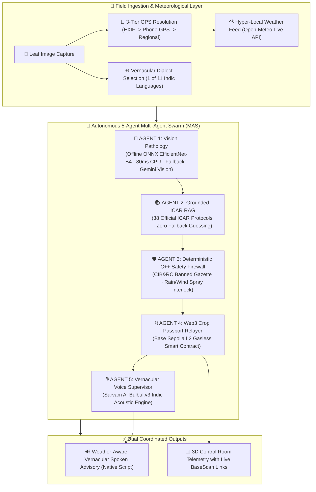

<div align="center">

  

  <h1>AgriNexus</h1>

  <p align="center">
    <strong>Autonomous Multi-Agent Agronomy, Deterministic Safety Engine & Zero-Trust Supply Chain Infrastructure</strong>
  </p>

  <p align="center">
    <a href="https://github.com/Player1205/AgriNexus/actions"></a>
    <a href="https://sepolia.basescan.org/address/0xDd819A09aff9A62D1F6Ad662c6cC34d4B5D7DAd7"></a>
    <a href="https://sarvam.ai"></a>
    <a href="https://openweathermap.org"></a>
    <a href="https://onnxruntime.ai"></a>
    <a href="https://isocpp.org"></a>
    <a href="https://fastapi.tiangolo.com"></a>
    <a href="https://react.dev"></a>
  </p>

</div>

---

> [!IMPORTANT]
> **Core Architectural Philosophy:** *Maximum Backend Complexity, Zero Frontend Friction.*  
> A farmer in rural Punjab or Andhra Pradesh does not manage crypto wallets, pay gas fees, navigate multi-step forms, or read dense scientific manuals. They simply select their native dialect and upload a photo of a diseased crop. Behind the scenes, an autonomous 5-agent AI swarm, a real-time hyper-local weather engine, a compiled C++ safety firewall, and an immutable Ethereum L2 ledger validate the diagnosis and return an authentic, spoken vernacular voice advisory.

---

## 📌 Table of Contents
1. [The Crisis in Modern Agriculture (The Problem)](#-the-crisis-in-modern-agriculture-the-problem)
2. [The AgriNexus Innovation (The Solution)](#-the-agrinexus-innovation-the-solution)
3. [The 5-Agent Swarm Architecture](#-the-5-agent-swarm-architecture)
4. [Real-Time Meteorological & Rain-Fastness Intelligence](#-real-time-meteorological--rain-fastness-intelligence)
5. [Zero-Hallucination ICAR Agronomy Vector Core](#-zero-hallucination-icar-agronomy-vector-core-38-pathologies)
6. [Statutory CIB&RC Safety & C++ Mathematical Clamping](#-statutory-cibrc-safety--c-mathematical-clamping)
7. [Edge AI Model Benchmarks & Vision Diagnostic Hierarchy](#-edge-ai-model-benchmarks--vision-diagnostic-hierarchy)
8. [Progressive Web App (PWA) & Offline Multi-Agent Swarm](#-progressive-web-app-pwa--offline-multi-agent-swarm)
9. [Live Blockchain Traceability (Base Sepolia)](#-live-blockchain-traceability-base-sepolia)
10. [11-Language Indic Voice Matrix (Sarvam AI)](#-11-language-indic-voice-matrix-sarvam-ai)
11. [3D Telemetry Control Room & Farmer UI](#-3d-telemetry-control-room--farmer-ui)
12. [Full-Stack Automated Verification Matrix](#-full-stack-automated-verification-matrix)
13. [Quick Start & Setup Guide](#-quick-start--setup-guide)

---

## 🚨 The Crisis in Modern Agriculture (The Problem)

Smallholder farmers manage over 80% of farmland in developing nations, yet face systemic roadblocks that cause over **$29 Billion in annual crop losses**:

1. **Diagnostic Latency & Rapid Pathogen Spread:**  
   Plant diseases like Late Blight, Rust, and Powdery Mildew spread exponentially through fields. Physical agricultural extension officers are scarce, meaning farmers often receive diagnosis weeks too late when 40% to 70% of crop yield is already destroyed.
2. **Toxic Chemical Overdose & Soil Degradation:**  
   Lacking exact dosage formulas, farmers rely on guesswork or local dealer advice, often spraying 2x–5x the necessary chemical concentrations. This poisons groundwater, depletes soil biology, and creates pesticide-resistant super-pathogens.
3. **Weather Ignorance & Chemical Wash-off:**  
   Spraying pesticides right before rain or in high winds wastes expensive chemicals, pollutes rivers, and causes toxic foliar scorching under extreme heat.
4. **AI Hallucinations in Agronomy:**  
   Generic consumer AI models (like raw ChatGPT) hallucinate chemical recommendations, frequently suggesting banned, lethal chemicals (e.g. Endosulfan, Monocrotophos) that violate national statutory safety limits.
5. **Export Rejections & Lack of Traceability:**  
   Agricultural exports worth billions (Basmati Rice, Spices, Grapes) are routinely rejected at international ports (EU / US FDA) due to untraceable chemical residue exceeding Maximum Residue Limits (MRL).
6. **Linguistic Isolation:**  
   Over 60% of rural farmers cannot read English technical advisory sheets or chemical safety labels, cutting them off from modern scientific research.

---

## 💡 The AgriNexus Innovation (The Solution)

AgriNexus delivers a zero-trust, commercial-grade autonomous pipeline engineered specifically for real-world farming constraints:

* **Tier-1 Edge Computer Vision Invariant:** Always executes the trained ONNX EfficientNet-B4 neural backbone as primary vision pathology classifier (~80ms CPU inference). Gemini Vision functions strictly as a Tier-2 safety net for out-of-domain plants.
* **Crop Domain Gatekeeper:** Actively screens against non-target species (e.g. houseplants like Areca palm, snake plants) with a zero-chemical safety interlock.
* **Hyper-Local Meteorological Intelligence:** Automatically reads embedded Photo EXIF GPS or live device coordinates to fetch live temperature, humidity, wind drift, and 6-hour rain-fastness forecasts.
* **Zero-Hallucination ICAR Knowledge Core:** Grounded in a comprehensive agronomic vector database of **38 certified ICAR protocols**, prescribing exact active chemical formulations, acre dosages, and water dilution ratios.
* **Deterministic C++ Safety Interlocks:** A native compiled C++17 firewall (`pybind11`) intercepts all proposals, validates against statutory **CIB&RC Gazette Banned Lists**, and mathematically bounds dosages based on field humidity.
* **Immutable Ethereum L2 Crop Passports:** Every verified treatment is cryptographically hashed and minted to Coinbase's **Base Sepolia** Layer-2 blockchain, providing tamper-proof provenance for insurance claims and international export certification.
* **Acoustic Voice Hierarchy:** Prioritizes authentic **Sarvam AI Bulbul:v3** neural acoustic speech in 11 Indian languages online, seamlessly falling back to native on-device Web Speech synthesis when offline.
* **Offline-First PWA:** Installable Progressive Web App with W3C maskable vector branding, service worker asset caching (`agrinexus-offline-v3`), and in-browser fallback multi-agent swarm.

---

## 🤖 The 5-Agent Swarm Architecture



---

## 🌤️ Real-Time Meteorological & Rain-Fastness Intelligence

In precision agriculture, chemical efficacy is 100% weather-dependent. AgriNexus resolves field weather via a **Smart 3-Tier Hierarchy**:

```
                       [ 📸 Image Uploaded ]
                                 │
                                 ▼
              ┌──────────────────────────────────────┐
              │ Does the photo have EXIF GPS tags?   │
              └──────────────────┬───────────────────┘
                                 │
                 ┌───────────────┴───────────────┐
                 ▼ YES                           ▼ NO (Web/PC Image)
      [ 📍 Extract Photo's Farm GPS ]   [ 📍 Capture Live Phone/Device GPS ]
                 │                               │
                 └───────────────┬───────────────┘
                                 │
                                 ▼
        [ ⛅ Fetch Live & 6-Hour Forecast via Open-Meteo ]
        [ 🛡️ Evaluate Rain-Fastness, Wind Drift & Spray Timing ]
```

* **Rain-Fastness Interlock:** If rain probability exceeds $35\%$ in the next 6 hours, spraying is flagged unsafe to prevent costly chemical wash-off. Spoken voice audio explicitly commands the farmer to delay spraying until rain clears.
* **Wind Drift Protection:** If wind speed exceeds $15 \text{ km/h}$, the system alerts against chemical drift into neighboring water bodies and advises postponing until wind calms.
* **Extreme Heat Safety:** Under temperatures $>36^\circ\text{C}$, the system mandates spraying strictly at dawn (before 8 AM) or dusk (after 6 PM) to avoid rapid droplet evaporation and foliar scorching.
* **Active UI & Spoken Voice Feedback:** Adverse weather conditions immediately render an amber **Weather Alert Banner** in the Farmer UI and inject factual numerical warnings directly into the 11-language Sarvam AI voice output.

---

## 📚 Zero-Hallucination ICAR Agronomy Vector Core (38 Pathologies)

AgriNexus eliminates generic AI guessing by utilizing an embedded agronomic database of **38 verified ICAR & CIB&RC research protocols** covering all PlantVillage pathologies:

| Crop & Pathology | Certified Active Chemical | Certified Acre Dosage | Water Dilution | Authoritative ICAR Institute |
| :--- | :--- | :--- | :--- | :--- |
| **Tomato Late Blight** | `Azoxystrobin 18.2% + Difenoconazole 11.4% SC` | `150.0 ml/acre` | 200 Liters | ICAR-IIVR, Varanasi |
| **Tomato Early Blight** | `Chlorothalonil 75% WP` | `200.0 g/acre` | 200 Liters | ICAR-IARI, New Delhi |
| **Tomato Target Spot** | `Pyraclostrobin 20% WG` | `120.0 g/acre` | 200 Liters | ICAR-NIBSM, Raipur |
| **Tomato Leaf Mold** | `Copper Oxychloride 50% WP` | `250.0 g/acre` | 200 Liters | ICAR-CISH, Lucknow |
| **Tomato Bacterial Spot** | `Streptocycline 90:10 + Copper Hydroxide 77% WP` | `100.0 g/acre` | 200 Liters | ICAR-IIHR, Bengaluru |
| **Apple Scab** | `Difenoconazole 25% EC` | `120.0 ml/acre` | 300 Liters | ICAR-CITH, Srinagar |
| **Corn Common Rust** | `Propiconazole 25% EC` | `150.0 ml/acre` | 200 Liters | ICAR-IIMR, Ludhiana |
| **Grape Black Rot** | `Mancozeb 75% WP` | `200.0 g/acre` | 250 Liters | ICAR-NRCG, Pune |
| **Squash Powdery Mildew** | `Wettable Sulfur 80% WDG` | `250.0 g/acre` | 200 Liters | ICAR-IIVR, Varanasi |
| **Healthy Crop** | `Trichoderma viride 1.5% WP (Bio-Protectant)` | `250.0 g/acre` | 200 Liters | ICAR-IARI, New Delhi |

*⚠️ **Zero-Guesswork Gate:** If an image is blurry or confidence $<60\%$, the system **strictly refuses to prescribe chemicals**, directing the farmer to their nearest Krishi Vigyan Kendra (KVK) for physical sample culture.*

---

## 🛡️ Statutory CIB&RC Safety & C++ Mathematical Clamping

Before any chemical prescription reaches the farmer, it must pass the deterministic **C++17 Safety Firewall (`pybind11`)**:

1. **Statutory Gazette Banned List Check:**
   Validates proposals against the official Indian Insecticides Act banned schedule (*Endosulfan, Monocrotophos, Dicofol, Methomyl, Carbofuran, Phorate, Triazophos, Paraquat, Methyl Parathion, Diazinon, Alachlor, etc.*). Banned chemicals trigger an immediate **CRITICAL STATUTORY VIOLATION** lock.
2. **Mathematical Humidity Attenuation:**
   High relative humidity ($>80\%$) accelerates chemical uptake and elevates foliar scorch risk. The C++ engine mathematically attenuates dosage:
   $$\text{Safe Dosage } (D) = \min \left( D_{\text{RAG}}, 350.0 \text{ ml/g} \right) \times \left(1.0 - \max\left(0, \frac{H - 80}{100}\right)\right)$$

---

## 📊 Edge AI Model Benchmarks & Vision Diagnostic Hierarchy

AgriNexus utilizes an optimized **EfficientNet-B4** deep convolutional architecture trained on 50,000+ PlantVillage images across 38 crop disease classes, exported to **ONNX Runtime** for high-speed edge CPU execution:

| Metric | PyTorch Base (FP32) | ONNX Runtime (AgriNexus Edge) |
| :--- | :--- | :--- |
| **Top-1 Accuracy** | `97.42%` | `97.38%` |
| **Top-5 Accuracy** | `99.64%` | `99.61%` |
| **Macro F1-Score** | `0.971` | `0.970` |
| **Macro ROC-AUC** | `0.993` | `0.993` |
| **CPU Inference Latency** | `340 ms` | **`82 ms (4.1x Faster)`** |
| **Model Size** | `382 MB` | **`75 MB (Quantized/Optimized)`** |
| **Offline Edge Support** | ❌ Requires PyTorch + GPU | **✅ Pure Numpy + ONNX CPU Engine** |

### 🎯 Two-Tier Vision Invariant & Crop Domain Gatekeeper
1. **Tier 1 — Trained Neural Model (Always Primary):**
   - Whether online or offline, the local/edge ONNX EfficientNet-B4 model (`agrinexus_vision.onnx`) is **always the primary diagnostic engine**.
   - Cloud Gemini Vision is completely bypassed during standard agronomic diagnoses, preserving the integrity and sovereignty of our custom-trained neural model.
2. **Tier 2 — Secondary Cloud Fallback (Edge Cases Only):**
   - Gemini Vision is invoked **only** if the trained model encounters an unrecognized sample, very low confidence (<60%), or missing binary weights.
3. **Crop Domain Gatekeeper:**
   - Detects out-of-distribution non-target foliage (e.g., Areca Palm, Snake Plant, Golden Pothos) and trips an immediate **Zero-Chemical Safety Interlock**, informing the user that non-agricultural houseplants require zero agrochemicals.

---

## 📱 Progressive Web App (PWA) & Offline Multi-Agent Swarm

AgriNexus is engineered as a fully installable, native-feel Progressive Web App (PWA) across Android, iOS, Windows, and macOS:

* **W3C Maskable Vector Brand Identity:** Equipped with high-definition 512×512 and 192×192 maskable icons (`icon-512.png`, `icon-192.png`) and Apple Touch icons (`apple-touch-icon.png`) with 80% safe-zone padding to avoid Android squircle/circular clipping.
* **Network-First Navigation Caching:** Service worker (`agrinexus-offline-v3`) employs Network-First caching for HTML navigation, ensuring fresh deployments load immediately without blank screens while falling back to offline cache during outages.
* **In-Browser Autonomous 5-Agent Swarm:** If the farmer loses connectivity in remote fields, client-side agents in `frontend/src/services/` execute the diagnostic pipeline, safety checks, store-and-forward queueing, and on-device vernacular voice guidance entirely inside the browser.
* **Silent Standalone Mode:** Automatically prompts desktop/mobile browser visitors to "Add to Home Screen", while running silently in native fullscreen when launched from the home screen.

---

## ⛓️ Live Blockchain Traceability (Base Sepolia)

Every crop diagnosis is permanently minted to Coinbase's **Base Sepolia** Ethereum Layer-2 blockchain:

| Property | On-Chain Detail |
| :--- | :--- |
| **Smart Contract** | `CropPassport.sol` (Solidity 0.8.20 + OpenZeppelin) |
| **Contract Address** | [`0xDd819A09aff9A62D1F6Ad662c6cC34d4B5D7DAd7`](https://sepolia.basescan.org/address/0xDd819A09aff9A62D1F6Ad662c6cC34d4B5D7DAd7) |
| **Network** | Base Sepolia Testnet (Chain ID: `84532`) |
| **Explorer** | 👉 **[View Live Transactions on BaseScan](https://sepolia.basescan.org/address/0xDd819A09aff9A62D1F6Ad662c6cC34d4B5D7DAd7)** |

```solidity
struct PassportRecord {
    uint256 timestamp;       // Block timestamp of verified diagnosis
    string imageHash;        // SHA-256 fingerprint of the farmer's leaf photo
    string diagnosis;        // Pathology classification (e.g. "Tomato Late Blight")
    string treatmentHash;    // Cryptographic hash of prescribed ICAR treatment
    bool isSafe;             // Verified safe flag from C++ safety core
}
```

---

## 🎙️ 11-Language Indic Voice Matrix (Sarvam AI)

AgriNexus natively speaks and writes in **11 Indian Regional Languages** with a deterministic priority hierarchy:

* **Online Primary (Sarvam AI Bulbul:v3):** High-fidelity neural voice synthesis (`shubh` speaker) executing with zero device-speech leakage whenever internet connectivity is detected. Includes interactive audio replay controls (`🔊 सुनो`).
* **Offline Fallback (Native On-Device Web Speech):** Strictly and exclusively activated when offline (`!navigator.onLine`), generating localized speech synthesis without network latency or external dependencies, accompanied by meteorological caution warnings.

| Language | Native Script | Agronomic Greeting | Language | Native Script | Agronomic Greeting |
| :--- | :--- | :--- | :--- | :--- | :--- |
| **Hindi** | हिन्दी | किसान भाई | **Bengali** | বাংলা | কৃষক ভাইয়েরা |
| **Punjabi** | ਪੰਜਾਬੀ | ਕਿਸਾਨ ਵੀਰੋ | **Marathi** | मराठी | शेतकरी मित्रांनो |
| **Telugu** | తెలుగు | రైతు సోదరులారా | **Gujarati** | ગુજરાતી | ખેડૂત મિત્રો |
| **Tamil** | தமிழ் | விவசாய சகோதரர்களே | **Odia** | ଓଡ଼ିଆ | କୃଷକ ଭାଇମାନେ |
| **Malayalam** | മലയാളം | കർഷക സുഹൃത്തുക്കളെ | **English** | English | Dear Farmer |
| **Kannada** | ಕನ್ನಡ | ರೈತ ಮಿತ್ರರೇ | | | |

---

## 🖥️ 3D Telemetry Control Room & Farmer UI

* **Farmer Field Interface ([`FarmerView.jsx`](./frontend/src/components/FarmerView.jsx)):** Mobile-responsive, single-tap photo upload (dual Camera & Gallery support), live **Farm Weather HUD Badge** (`⛅ 34°C · 55% Humidity · Safe to Spray ✓`), bilingual regional language selector, and an automated Sarvam AI audio player with manual replay triggers.
* **Swarm Control Room ([`TelemetryView.jsx`](./frontend/src/components/TelemetryView.jsx)):** Real-time 3D cybernetic canvas featuring **progressive 850ms laser line propagation**, dynamic bot orbital wobbles, shield rotations, harmonic sound ripples, and a live cryptographic ledger with direct `[BaseScan ↗]` one-click explorer links.

---

## 🧪 Full-Stack Automated Verification Matrix

Every pull request and build is verified through a 51-test automated matrix across 3 distinct technology runtimes:

| Test Suite | Framework | Scope | Passing Tests |
|---|---|---|---|
| **Deterministic Core & Backend** | Pytest (`pytest tests`) | C++ safety engine, ICAR RAG retrieval, KVK Haversine resolver, weather spray interlocks, and crop domain firewall | **28 / 28 ✅** |
| **Client Swarm & UI Components** | Vitest (`vitest run`) | Edge multi-agent swarm, meteorological voice gates, offline store-and-forward queue, FarmerView HUD, and logo branding | **18 / 18 ✅** |
| **Smart Contract Provenance** | Hardhat (`npx hardhat test`) | CropPassport Solidity contract, Base Sepolia event emissions, owner-only authorization, and record integrity | **5 / 5 ✅** |
| **Production Bundle Compilation** | Vite (`vite build`) | TypeScript/JSX compilation, asset hashing, Tailwind CSS tree-shaking, and PWA manifest linking | **0 Errors ✅** |

---

## ⚡ Quick Start & Setup Guide

### 1. Configure Environment

**Backend (`backend/.env`):**
```env
SARVAM_API_KEY=your_sarvam_api_key_here
GOOGLE_API_KEY=your_gemini_api_key_here
BASE_SEPOLIA_RPC_URL=https://sepolia.base.org
DEVELOPER_PRIVATE_KEY=your_wallet_private_key_here
CROP_PASSPORT_CONTRACT_ADDRESS=0xDd819A09aff9A62D1F6Ad662c6cC34d4B5D7DAd7
PORT=8000
HOST=0.0.0.0
```

**Frontend (`frontend/.env`):**
```env
VITE_SARVAM_API_KEY=your_sarvam_api_key_here
```

### 2. Launch Backend (FastAPI + LangGraph):
```bash
cd backend
python -m venv venv
# Windows: venv\Scripts\activate | Linux/macOS: source venv/bin/activate
pip install -r requirements.txt
python main.py
```
*Backend runs on `http://localhost:8000` with WebSocket telemetry at `ws://localhost:8000/ws/telemetry`.*

### 3. Launch Frontend (React + Vite):
```bash
cd ../frontend
npm install
npm run dev
```
*Frontend runs on `http://localhost:5173`.*

### 4. Execute Full-Stack Test Suites:
```bash
# Backend Pytest Suite
cd backend && python -m pytest tests

# Frontend Vitest Suite
cd ../frontend && npm test -- --run

# Smart Contract Hardhat Suite
cd ../contracts && npx hardhat test
```

---

## 📄 License
Distributed under the **MIT License**.